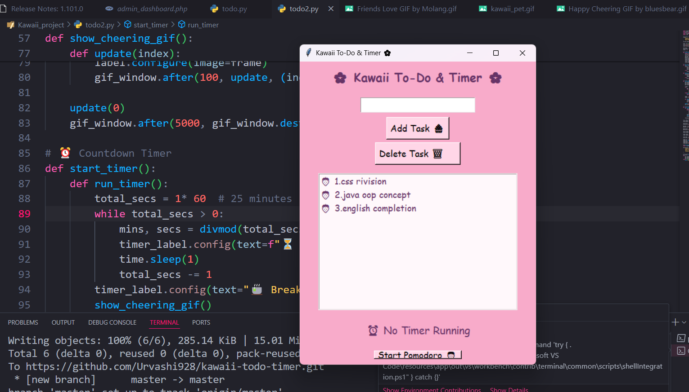

# 🌸 Kawaii To-Do List + Study Timer

A cute, pastel-themed Python app for managing your daily tasks and study sessions with style! 🐰💻  
Built using **Python**, **Tkinter**, and lots of love 💖

---

## ✨ Features

- ✅ Add / remove tasks to your to-do list
- ⏱️ Built-in Pomodoro-style study timer
- 🎀 Kawaii color scheme and playful UI
- 💾 Lightweight, simple to use
- 🧠 Great for students and studygram creators

---

## 📸 Screenshots



---

## 🚀 Getting Started

### 🧰 Requirements
- Python 3.x
- Tkinter (usually pre-installed)

### 📦 Installation

```bash
git clone https://github.com/yourusername/kawaii-todo-timer.git
cd kawaii-todo-timer
python todo2.py
